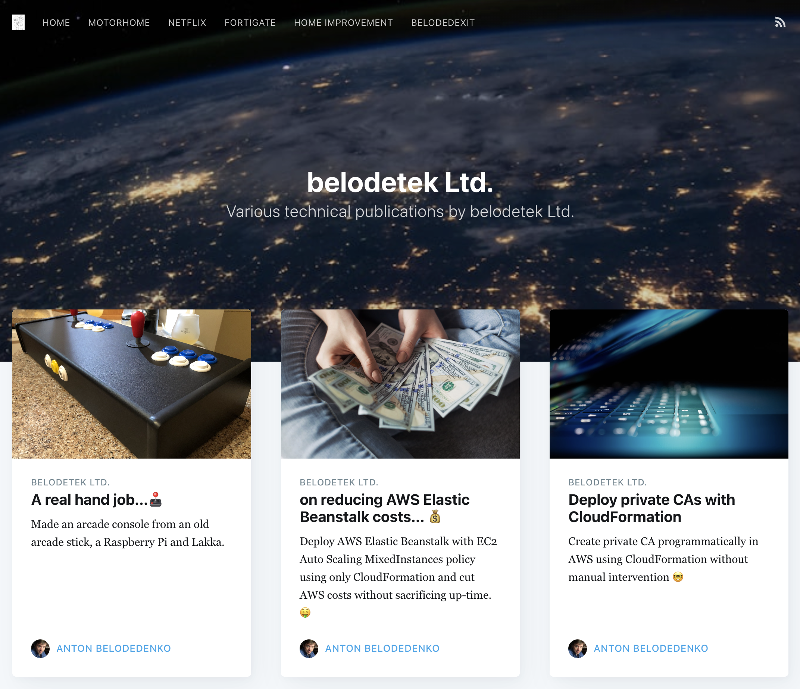

## [belodetek Ltd]
> List of articles recovered from the destroyed blog. Missing image and videos may be
  found in the public [iCloud shared album].

* [Up-cycled Raspberry Pi console](https://web.archive.org/web/20230321195331/https://anton.belodedenko.me/shoryuken/) [[mhtml](https://belodetek.s3.us-east-1.amazonaws.com/blog/Up-cycled+Raspberry+Pi+console.mhtml)]
* [Deploy Elastic Beanstalk with MixedInstances policy using only CFN](https://web.archive.org/web/20230605060719/https://anton.belodedenko.me/cheaper-aws-beanstalk/) [[mhtml](https://belodetek.s3.us-east-1.amazonaws.com/blog/Deploy+Elastic+Beanstalk+with+MixedInstances+policy+using+only+CFN.mhtml)]
* [Create AWS private CAs using CloudFormation](https://web.archive.org/web/20240913222305/https://anton.belodedenko.me/acm-pca-with-cloudformation/) [[mhtml](https://belodetek.s3.us-east-1.amazonaws.com/blog/Create+AWS+private+CAs+using+CloudFormation.mhtml)]
* [Authenticate G Suite users at the (app) load-balancer in AWS](https://web.archive.org/web/20231004191646/https://anton.belodedenko.me/google-saml-auth-load-balancer/) [[mhtml](https://belodetek.s3.us-east-1.amazonaws.com/blog/Authenticate+G+Suite+users+at+the+(app)+load-balancer+in+AWS.mhtml)]
* [CloudFormation generic custom resource provider written in Python](https://web.archive.org/web/20240620175548/https://anton.belodedenko.me/generic-custom-resource-provider/) [[mhtml](https://belodetek.s3.us-east-1.amazonaws.com/blog/CloudFormation+generic+custom+resource+provider+written+in+Python.mhtml)]
* [Simple WebUI for DD-WRT routers to connect to VPN providers.](https://web.archive.org/web/20240620194653/https://anton.belodedenko.me/uk-porn-bypass-ageid/) [[mhtml](https://belodetek.s3.us-east-1.amazonaws.com/blog/Simple+WebUI+for+DD-WRT+routers+to+connect+to+VPN+providers..mhtml)]
* [Couchbase server on Amazon ECS, persistent storage and awsvpc net mode](https://web.archive.org/web/20240620192058/https://anton.belodedenko.me/couchbase-aws-ecs-docker/) [[mhtml](https://belodetek.s3.us-east-1.amazonaws.com/blog/Couchbase+server+on+Amazon+ECS%2C+persistent+storage+and+awsvpc+net+mode.mhtml)]

[belodetek Ltd]: https://belodetek.s3.us-east-1.amazonaws.com/blog/belodetek+Ltd.+-+on+many+things+randomly+and+in+no+particular+order.mhtml
[iCloud shared album]: https://www.icloud.com/sharedalbum/#B0wG4TcsmGTRUEl
